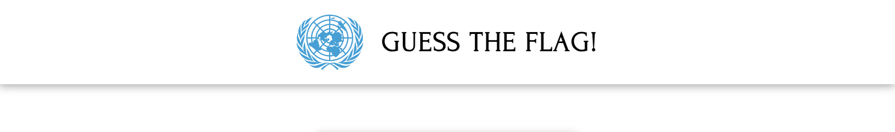
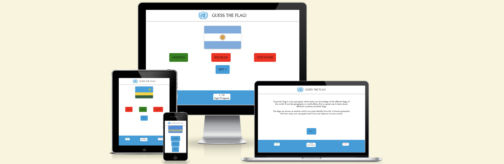
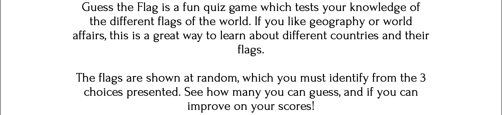
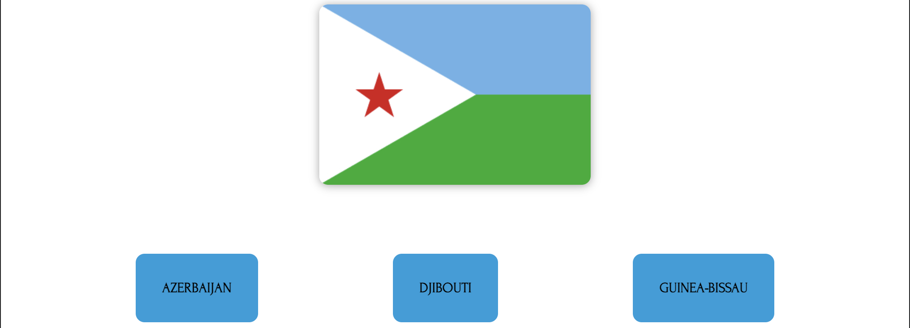

---

# *Guess the Flag!*

This quiz is an interactive way for visitors to learn about the different countries of the world, by identifying their flags.
For those who are interested in global affairs or geography, it is a great learning aide, as the flags are presented in random order.  It gives immediate feedback based on the visitors' answers.  It suggests a challenge to them to improve their score, which is recorded as correct and incorrect.

The site can be accessed by this [link](https://jarlathmacs.github.io/guess-the-flag)

## Features 

### Existing Features

- __Guess the Flag! Header__

- This appears at the top of all pages.  The logo is to the left side, which is the United Nations logo.  
- The heading is to the right of the logo.

- __Landing page__

  - Here the visitors are introduced to the quiz.  It is described in short, as well as the purpose presented.  The challenge to achieve a best score motivates the visitors to go through the quiz multiple times.
  

- __Start button__

  - They are presented with a start button in order to initiate the first quiz round. 

- __Presentation of the flag challenges__

  - This is where the flags are presented in random order.
  - In addition, visitors are presented with 3 possible answers to choose from.

  - As the cursor is moved over any 1 of the 3 choices, the background changes from a light (UN) blue to black, and the text from black to white.
  

- __The footer__ 

  - The footer has 4 links to social media sites.  The links all open to a new tab to allow for easy navigation for the user. 

- __Meet our Pugs page__

  - The page presents images of a variety of different age pugs, aiming to create interest from users in what the organization's mission is.
  - This section is invaluable to the user as they can see, from a variety of different pugs, hopefully the possibility of further engaging the organization. 

- __Contact us page__

  - Here the user can take action to contact the organization, whether with an interest in adopting, fostering, volunteering, or donating to the organization.  

- __Response page__

  - This page displays after the user has submitted their contact details.  It presents a confirmation and thank you message.  It promises that they will receive a reply within 24 hours, to preserve their interest.

### Possible future features

- Providing more specific details about each pug pictured, biographies, etc.

## Testing 

- The website was tested and works correctly on the following browsers: Chrome, Firefox, Safari.
- Functionality, responsiveness, and appearance were all good.
- The website was checked by using devtools to make sure it looks good on all screen sizes.
- Manual testing showed all features work as intended.
- The contact us form works as intended, and includes validation.

### Validator Testing 

- HTML
  - No errors were returned when passing through the official W3C validator.
- CSS
  - No errors were found when passing through the official (Jigsaw) validator.
- Lighthouse
  - Accessibility of color palette used, and alt attributes, etc. was confirmed.

### Unfixed Bugs

No unfixed bugs.

## Deployment

- The site was deployed to GitHub pages.  The steps for deployment are as follows: 
  - In the GitHub repository, click on the Settings tab.  On the left menu, click on the pages option.
  - Under the build and deployment, under branch, select main and root options.  Click the save button. 

The live link can be found here - (https://jarlathmacs.github.io/portfolio-project-1/index.html)

## Credits 

### Content 

- The HTML code to make the social media links in the footer was taken from the Love Running project.
- The CSS code in the media query for >=1200px for the reasons to own a dog section, is taken from the Love Running project.
- The icons in the footer and throughout the website were taken from [Font Awesome](https://fontawesome.com).
- The text used in the Why get a dog section was taken from (https://newsnetwork.mayoclinic.org/discussion/mayo-clinic-q-and-a-how-owning-pets-can-lead-to-a-healthier-lifestyle)
- The text used in the 5 Reasons to adopt section was taken from (https://www.aspca.org/news/10-reasons-adopt-shelter-dog)

### Media

- The favicon and logo were created using the website [Brandmark](https://brandmark.io)
- The hero image was taken from (https://www.pugsandkisses.com/listing/898987938/pug-wall-art-hats-and-ties-pug-art-print)
- The images used for the Meet our Pugs page were taken from [Austin Pug Rescue](https://austinpugrescue.com)
- The image for the circle-cover-bg element and the Contact us page were taken from (https://www.instagram.com/ring0thepug)
- The image in the 5 Reasons to adopt was taken from (https://www.google.com/url?sa=i&url=https%3A%2F%2Fespace-trail-du-couserans.com%2F%3Fs%3Dpugs-life-movie-poster-%25E2%2580%2593-your-art-by-you-bb-Ayd6LWfl&psig=AOvVaw2trlyuYa4xoO13IRaztsVm&ust=1721712418610000&source=images&cd=vfe&opi=89978449&ved=0CBEQjRxqGAoTCIiC5ez0uYcDFQAAAAAdAAAAABC1EQ)