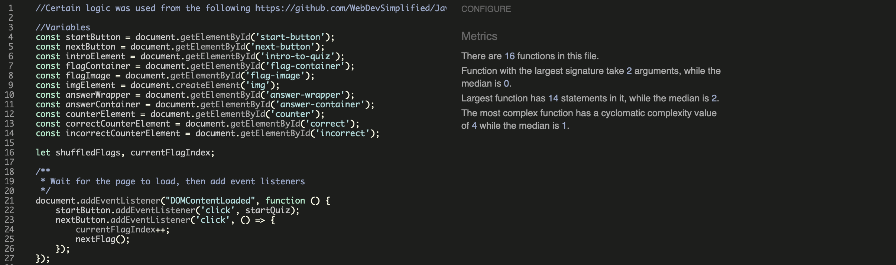
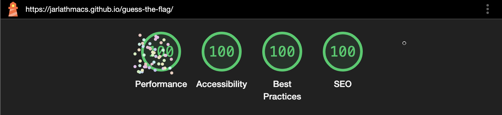

---

# *Guess the Flag!*

This quiz is an interactive way for visitors to learn about the different countries of the world, by identifying their flags.
For those who are interested in global affairs or geography, it is a great learning aide, as the flags are presented in random order.  It gives immediate feedback based on the visitors' answers.  It suggests a challenge to them to improve their score, which is recorded as correct and incorrect.

The site can be accessed by this [link](https://jarlathmacs.github.io/guess-the-flag)

## Features 

### Existing Features

- __Guess the Flag! Header__

  - This appears at the top of all pages.  The logo is to the left side.  
  - The heading is to the right of the logo.

- __Landing page__

  - Here the visitors are introduced to the quiz.  It is described in short, as well as the purpose presented.  The challenge to achieve a best score motivates the visitors to go through the quiz multiple times.
  

- __Start button__

  - They are presented with a Start button in order to initiate the first quiz round. 

- __Presentation of the flag challenges__

  - This is where the flags are presented in random order.
  - In addition, visitors are presented with 3 possible answers to choose from.

  ~ As the cursor is moved over any 1 of the 3 choices, the background changes from a light blue to black, and the text from black to white.
  

- __Answers__

  - As soon as the visitor clicks on 1 of the 3 choices, immediate feedback is given in the form of the background of the buttons changing to green or red, depending on the correct answer.  

  ~ In addition to the backgrounds of the answer choice buttons changing to green or red, the Next button also appears below them.  This allows the visitor to advance to the next flag in the quiz round.

- __Restart button__

  - Once the visitor has progressed through the total number of flags in the quiz round, they are presented with a Restart button in place of the Next or Start buttons.

- __Counters section__

  - Here the visitor can watch in real time the score tally accumulate with both correct and incorrect answers counted.  In addition, the total number of questions answered is also kept a running tally of.  The correct score is written in green, and the incorrect in red. 

### Possible future features

- The site can relatively easily be scaled up, in increasing the number of flags which are presented to the visitors.
- Randomisation of the 2 possible incorrect answer choices presented along with the correct answer choice.  This would create a higher level of difficulty for the visitors.

## Testing 

- The website was tested and works correctly on the following browsers: Chrome, Firefox, Safari.
- Functionality, responsiveness, and appearance were all good.
- The website was checked by using devtools to make sure it looks good on all screen sizes.
- Manual testing showed all features work as intended.
- The logic of the counters was tested and passed to make sure the scores and tallies are accurate.

### Validator Testing 

- HTML
  - No errors or warnings were returned when passing through the official [W3C validator](https://validator.w3.org/nu/?doc=https%3A%2F%2Fjarlathmacs.github.io%2Fguess-the-flag%2F)

- CSS
  - No errors were found when passing through the official [(Jigsaw) validator](https://jigsaw.w3.org/css-validator/validator?uri=https%3A%2F%2Fjarlathmacs.github.io%2Fguess-the-flag%2F&profile=css3svg&usermedium=all&warning=1&vextwarning=&lang=en)

- JavaScript
  - No errors or warnings were found when passing through the [Jshint validator](https://jshint.com)
    - The following metrics were returned: 
    - There are 16 functions in this file.
    - Function with the largest signature takes 2 arguments, while the median is 0.
    - Largest function has 14 statements in it, while the median is 2.
    - The most complex function has a cyclomatic complexity value of 4 while the median is 1.

## Accessibility

- Lighthouse
  - Accessibility of color palette used, and alt attributes, etc. was confirmed.

## Responsiveness

- The website was checked for responsiveness with [Am I Responsive](https://ui.dev/amiresponsive?url=https://jarlathmacs.github.io/guess-the-flag)

## Bugs

### Unfixed Bugs

No unfixed bugs.

## Deployment

- The site was deployed to GitHub pages.  The steps for deployment are as follows: 
  - In the GitHub repository, click on the Settings tab.  On the left menu, click on the pages option.
  - Under the build and deployment, under branch, select main and root options.  Click the save button. 

The live site can be found at this [link](https://jarlathmacs.github.io/guess-the-flag)

## Credits 

### Content

- Wireframes were made for the website using [Balsamiq](https://balsamiq.com)

- Certain logic was used from the following repository on [GitHub](https://github.com/WebDevSimplified/JavaScript-Quiz-App)

### Media

- The favicon was created using the website [Font Awesome](https://fontawesome.com/icons/flag?f=classic&s=solid&pc=%23009edb&sc=%23009edb) and converted using the website [Favicon.io](https://favicon.io/favicon-converter)
- The logo and colour scheme were taken from the website of the [UN](https://www.un.org/styleguide/pdf/UN_brand_identity_quick_guide_2020.pdf)
- The flag images were downloaded from [Flagpedia.net](https://flagcdn.com/h240-jpeg.zip)